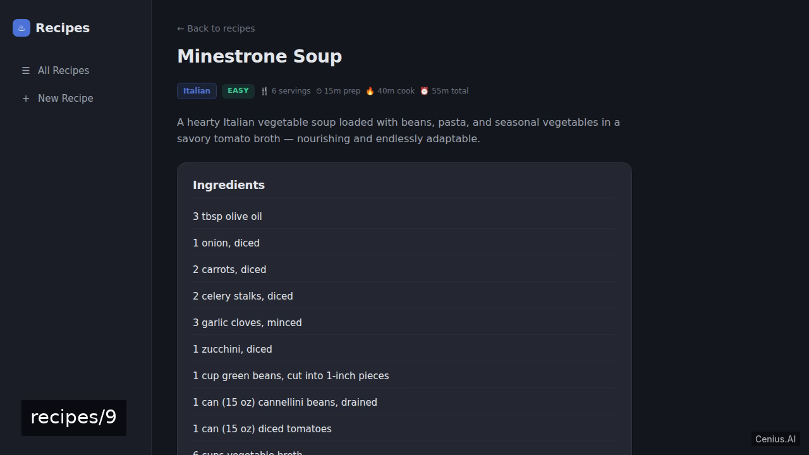
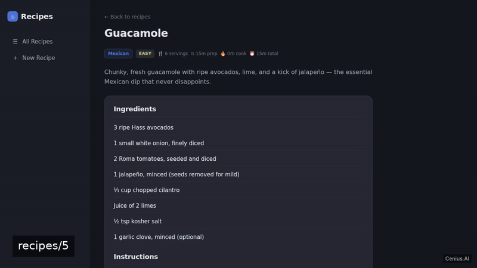
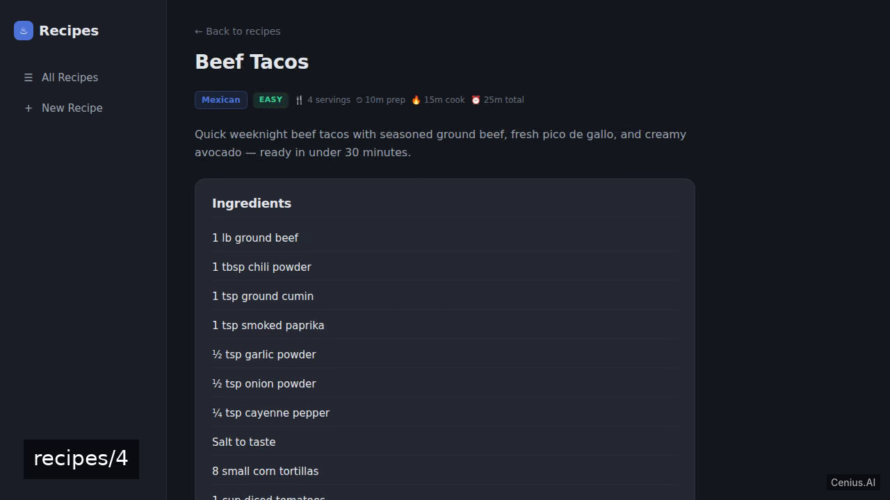
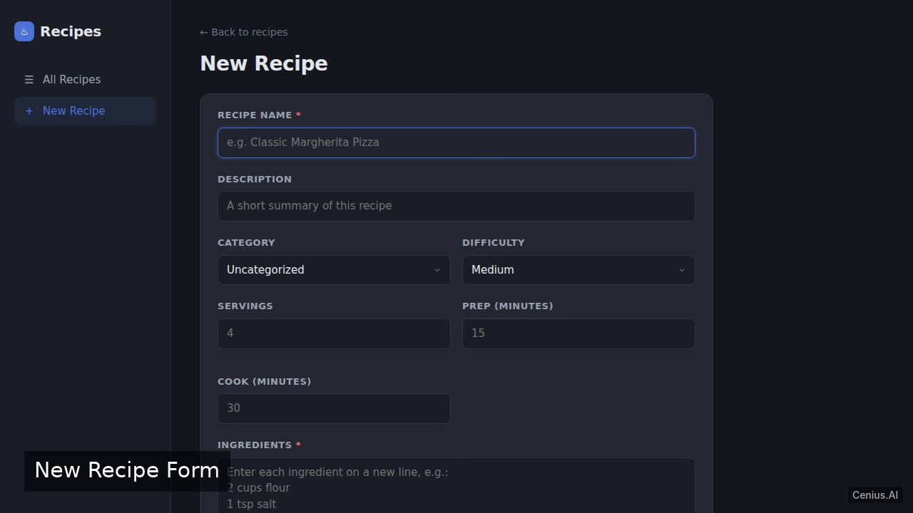

# Recipes Web App — production-ready Crystal recipe manager starter

**Recipes Web App** is a free, open-source recipe manager built with Crystal. A web application for managing recipes, built with Crystal and Lucky framework (or Kemal if Lucky's Postgres coupling is an issue), using SQLite for persistence. Run it locally, deploy it as a self-hosted recipe manager, or [remix it on cenius.ai](https://cenius.ai/marketplace/p/recipes-web-app?ref=gh&utm_campaign=recipes-web-app-crystal) to make it your own — the whole application (code, design, seeded demo data) ships in this repository under the Apache-2.0 license.

[](LICENSE)  [](https://cenius.ai)

[](https://cenius.ai/marketplace/p/recipes-web-app?ref=gh&utm_campaign=recipes-web-app-crystal)

> **▶ [Open & edit in cenius.ai](https://cenius.ai/marketplace/p/recipes-web-app?ref=gh&utm_campaign=recipes-web-app-crystal)** — one click to an editable workspace: describe changes in plain English, get an instant preview, one-click deploy and host. Modifications made on the platform come with full rebrand & relicense rights.

_Local clone? See [Quick start](#quick-start) below. cenius.ai is the zero-setup path._

## Demo





▶ **[Watch the full demo video](https://cenius.ai/marketplace/p/recipes-web-app?ref=gh&utm_campaign=recipes-web-app-crystal)** — the complete walkthrough, playing on the project's cenius.ai page · [MP4 file](.github/media/demo.mp4)

## Screenshots

  

## Features

- Recipe list
- Create recipe
- Recipe detail
- Seed data

## Quick start

```bash
./install.sh   # installs dependencies + seeds demo data
```

See [`INSTALL.md`](INSTALL.md) for full setup and usage instructions.

## Usage guide

### Starting the Server

In the project directory, run:

```bash
crystal run src
```

Alternatively, build the binary first and then execute it:

```bash
shards build
./bin/app
```

The server listens on `http://0.0.0.0:3000` (or the port set in `PORT`).

### Accessing the Application

Open a web browser and navigate to `http://localhost:3000`.

#### Recipe List (Home Page)

The root URL (`/`) displays all stored recipes. Click any recipe to view its details.

#### Add a Recipe

Go to `http://localhost:3000/recipes/new`. Fill out the form and submit it. The new recipe will appear in the list.

#### Recipe Detail

Each recipe in the list links to `/recipes/:id` where `:id` is the numeric identifier. This page shows the full recipe information.

### Curl Examples

You can interact with the app via command line:

```bash
## Fetch the recipe list (HTML)
curl http://localhost:3000/
```

All other endpoints return HTML pages and are intended for browser usage.

_Full guide: [`USAGE.md`](USAGE.md)_

## Architecture

Crystal application, delivered as a complete, runnable project (241 files). Top-level layout: `bin/`, `db/`, `lib/`, `public/`, `spec/`, `src/`. `install.sh` provisions dependencies and seeds demo data, so the app boots with something to show. Setup details live in [`INSTALL.md`](INSTALL.md).

## FAQ

### How do I run Recipes Web App on my own server?

`git clone` + `./install.sh` gets you a running instance — the install script provisions dependencies and demo data. Full steps live in [`INSTALL.md`](INSTALL.md); nothing external is needed to try it.

### Is white-labeling Recipes Web App allowed?

Absolutely. [Open it on cenius.ai](https://cenius.ai/marketplace/p/recipes-web-app?ref=gh&utm_campaign=recipes-web-app-crystal) and remix it there — platform modifications come with full rebrand and relicense rights over your derivative, so the result is entirely yours.

### Is there a no-code way to modify Recipes Web App?

Describe what you want changed on [cenius.ai](https://cenius.ai/marketplace/p/recipes-web-app?ref=gh&utm_campaign=recipes-web-app-crystal) — no code editing needed; the platform produces a fresh build you can download and deploy.

### What is Recipes Web App built with?

Recipes Web App is a Crystal application — and this repository holds the complete, runnable source, not a stripped-down sample. Highlights include seed data.

### Can I use Recipes Web App in a commercial project?

Yes — it ships under the Apache-2.0 license, which permits commercial use, modification and redistribution. The full text is in [LICENSE](LICENSE).

## License & rebranding

Released under the [Apache License 2.0](LICENSE) (© 2026 Cenius AI) — free for personal and commercial use. The Cenius name/logo are trademarks (see NOTICE).

**Need a customized version?** [Remix this app on cenius.ai](https://cenius.ai/marketplace/p/recipes-web-app?ref=gh&utm_campaign=recipes-web-app-crystal) — modifications made on the platform come with **full rebrand & relicense rights** over your derivative.

## Built with cenius.ai

This entire application — code, design, seeded demo data — was generated on **[cenius.ai](https://cenius.ai)** from a plain-English description.

- 🚀 [Build your own app on cenius.ai](https://cenius.ai)
- 🎛️ [Remix Recipes Web App on the marketplace](https://cenius.ai/marketplace/p/recipes-web-app?ref=gh&utm_campaign=recipes-web-app-crystal) — open it in a workspace, prompt for changes, and ship your own version.

More open-source apps: [the Cenius-ai catalog](https://github.com/Cenius-ai) · [showcase index](https://github.com/Cenius-ai/showcase)
